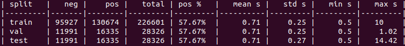
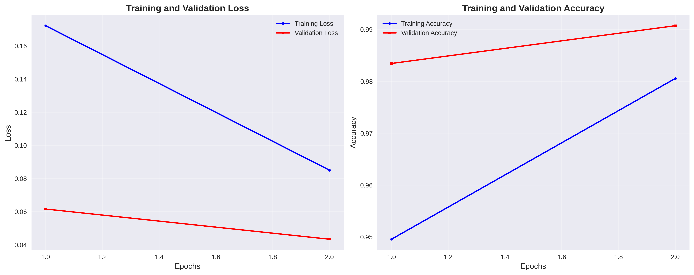
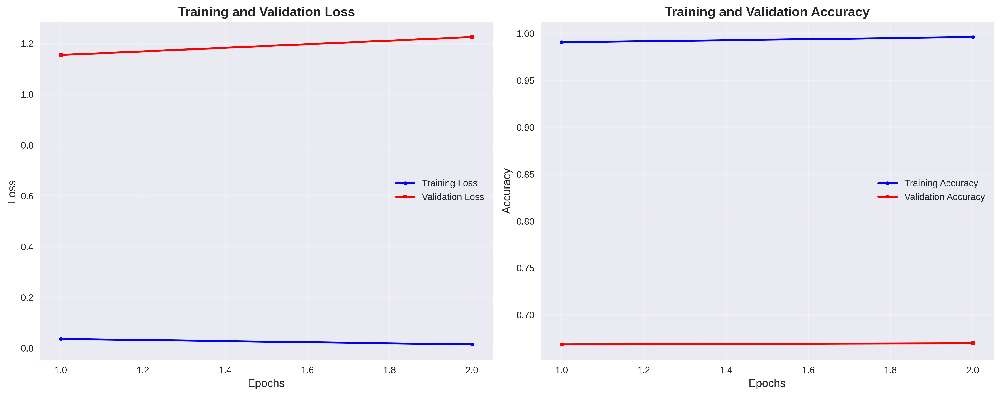
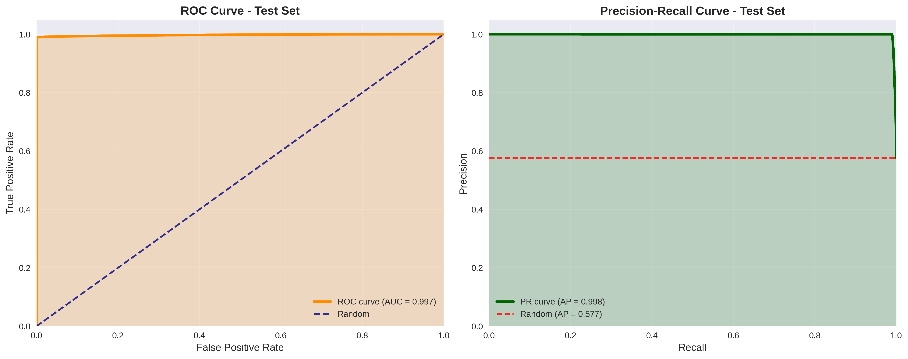
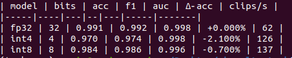

Following is the Drone Detector project 


Work is based on the geronimo [dataset](https://huggingface.co/geronimobasso). One can find script for train/val/test split in /data folder. Prep includes cutting dataset to pieces of 1 second which is the target chunk size. I used the pretrained encoder from the recent [ViT](https://github.com/cwx-worst-one/EAT) SOTA architecture as the backbone and trained classification head for binary classification (drone/ambient). 

The important observation is that the dataset is built as a combination of several smaller datasets, thus the probability of having data drift clusters is above zero.

### Installation:

```bash
make env          # 1×: create env & install deps
make test         # run tests inside env
make get_ckpts    # fetch model checkpoints
make prep_split   # preprocess the dataset
make patch_model_dict  # adapt model keys for out task
```

After preprocessing (chunking/trimming), dataset looks like this: 



### Preprocessing

Selected sound representation is MEL Spectrogram. The hyperparameters were following:

    - n_mels = 128
    - frame_size = 25ms
    - hop_length = 10ms
    - sample_rate = 16kHz
    - norm_mean = -4.268
    - norm_std = 4.569

As for the spectral augmentations, I used:

    - time_masks
    - frequency_masks
### Training

To initiate fine-tuning (training from scratch is not supported at this point), run: 
```bash
python3 train.py --ckpt_path checkpoint.pt \
                 --preproc_dataset_path geronimo_processed \
                 --exp_name test_new_5 --spec_aug True \
                 --model_cfg_path config_EAT_base.json \
                 --wandb True
```

Framework supports **wandb** logging, but you need to login. Also, the best checkpoint will be saved in `exp/exp_name`, and stats in /`images` subfolder. I do not support ddp training as of yet, but this will be a subject of future release.


### Inference

You can try out your model in **standard** torch format using `inference.py` script. It includes streamlit UI which runs on 8501 port standardly. You can run it using command:
```bash
streamlit run inference.py -- \
                           --ckpt_path EAT_base_adapted.pt  \
                           --cfg_path  config_EAT_base.json
```


### Export
To export to `.onnx` format, you can use `export/export_to_onnx.py` script. Supported formats are: `float32`, `bfloat16`, `int8` and `int4`.


### Docker 

For now, only CPU docker image is supported, but it shouldn't be hard to modify for GPU image. You need special docker image from nvidia site & flag for running container with cuda.


You can build image using `make docker_build` and run it using `make docker_run`. Make sure you have available microphone. If the docker_run doesn't work automatically, you can try something like: 

```bash
docker run -it --device /dev/snd   --group-add $(getent group audio | cut -d: -f3)   -e PULSE_SERVER=unix:${XDG_RUNTIME_DIR}/pulse/native   -v ${XDG_RUNTIME_DIR}/pulse/native:${XDG_RUNTIME_DIR}/pulse/native   -v ~/.config/pulse/cookie:/root/.config/pulse/cookie   --name trial_1   drone-detector:latest    python3 s_infer.py"
```

The quantized int4 checkpoint is downloaded directly from google drive.


### Results: 

Spectral augmentation helps to prevent overfitting.

<p>
  <figure>
    
    <figcaption><strong>With augmentation</strong></figcaption>
  </figure>

  <figure>
    
    <figcaption><strong>No augmentation</strong></figcaption>
  </figure>
</p>


ROC & PR curves for best checkpoint:
<p>
  
</p>


You can obtain checkpoint from [Google Drive](https://drive.google.com/file/d/1B5h-eehdj_oIKbTfrRC5YB_j2R02Ua8n/view?usp=sharing)


### Results (quantized):

<p>
  
</p>   


After the quantization I had to perform the calibration; for the int8 I used **0.3** threshold and for int4 I used **0.01** threshold. Note that this can further be improved. Results are reported on 1000 samples chunk of test subset of geronimo dataset.

***LLM usage***
 - code design (visualizations, tables)
 - unit-tests
 - debugging :)
 - RUFF - formatting
